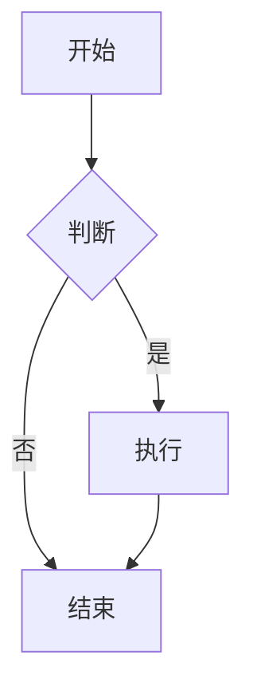
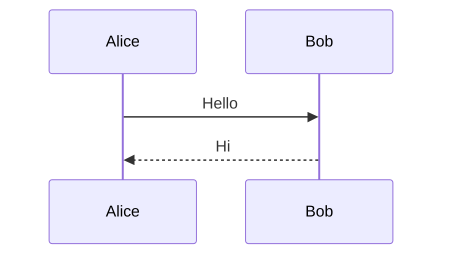
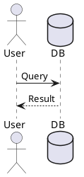
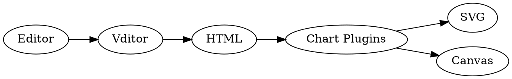

# 📐 Mermaid、PlantUML 与 Graphviz

>i **每个图表先展示写法和渲染效果。使用方式中的 ```xxx 表示代码块围栏标记。**

## 1. Mermaid 流程图

**使用方式：用 ```mermaid 包裹**

```text
graph TD
    A[开始] --> B{判断}
    B -->|是| C[执行]
    B -->|否| D[结束]
    C --> D
```

**渲染效果：**



## 2. Mermaid 时序图

**使用方式：用 ```mermaid 包裹**

```text
sequenceDiagram
    Alice->>Bob: Hello
    Bob-->>Alice: Hi
```

**渲染效果：**



## 3. PlantUML

**使用方式：用 ```plantuml 包裹**

```text
@startuml
actor User
database DB
User -> DB: Query
DB --> User: Result
@enduml
```

**渲染效果：**



## 4. Graphviz (DOT)

**使用方式：用 ```graphviz 包裹**

```text
digraph G {
  rankdir=LR;
  Editor -> Vditor -> HTML;
  HTML -> "Chart Plugins";
  "Chart Plugins" -> SVG;
  "Chart Plugins" -> Canvas;
}
```

**渲染效果：**


